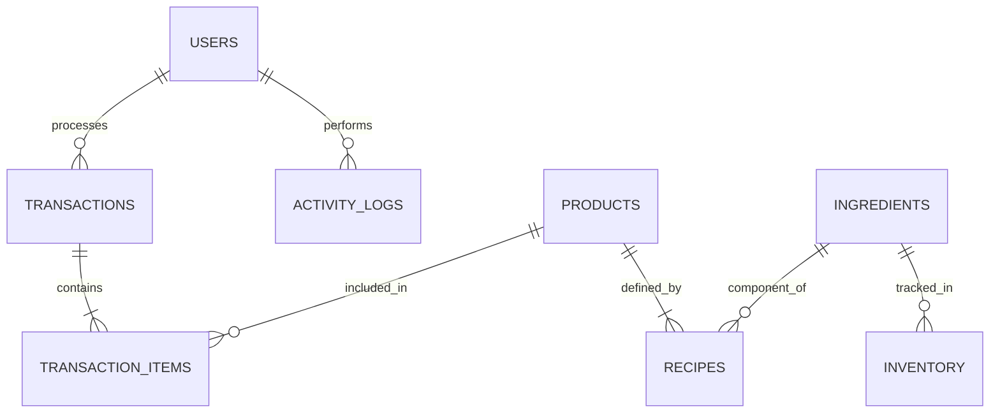

# Digitalisasi & Manajemen **Burger Bangor** 🍔🔥


> **A modern, robust, and mouth-watering solution for managing daily operations—from ordering to inventory.**
> *Built for speed, accuracy, and scalability.*

<div align="center">

[](https://nextjs.org/)
[](https://www.typescriptlang.org/)
[](https://tailwindcss.com/)
[](https://orm.drizzle.team/)
[](https://supabase.com/)

</div>

---

## 📖 About The Project

**Burger Bangor Management System** is a comprehensive full-stack application designed to digitize the workflow of a fast-food franchise. It replaces manual logging with a streamlined, real-time digital interface.

From the moment a cashier takes an order to the automatic deduction of ingredient stock, this system handles it all. It ensures that managers have a bird's-eye view of operations while staff can work efficiently without friction.

### Why this exists?
- **Availability:** Access anywhere, anytime.
- **Accuracy:** Eliminate human error in stock calculation.
- **Security:** Strict role-based access control (RBAC).

---

## 🚀 Key Features

### 🔐 Multi-Role Authentication & Security
Powerful Role-Based Access Control (RBAC) securely limits access based on user roles:
- **Admin**: Full system control, user management, and sensitive settings.
- **Manager**: Access to dashboards, reports, and inventory management.
- **Cashier**: Optimized POS interface for fast transactions.

### 🛒 High-Speed Point of Sale (POS)
A lightning-fast POS interface designed for high-traffic environments:
- **Instant Cart**: Add/remove items with zero latency.
- **Smart Calculation**: Automatic tax and total calculations.
- **Receipt Ready**: Optimized layout for thermal printers.

### 📦 Smart Inventory & Recipe Engine
The heart of the system. We don't just track products; we track **atoms**:
- **Recipe Management**: Link raw ingredients (e.g., "Beef Patty", "Cheese Slice") to products.
- **Auto-Deduction**: Selling a "Cheeseburger" automatically reduces the stock of buns, meat, and cheese.
- **Low Stock Alerts**: (Coming Soon) Visual indicators when supplies run low.

### 📊 Real-Time Analytics Dashboard
Data-driven decision making made beautiful:
- **Financial Overview**: track revenue, sales count, and trends.
- **Top Products**: Identify best-sellers instantly.
- **Interactive Charts**: Visualized data for quick insights.

---

## 🛠️ Tech Stack

This project uses the bleeding edge of web development tech:

| Category | Technology | Description |
| :--- | :--- | :--- |
| **Framework** | [Next.js 16 (App Router)](https://nextjs.org/) | The React Framework for the Web. |
| **Language** | [TypeScript](https://www.typescriptlang.org/) | Strict syntactical superset of JavaScript. |
| **Styling** | [Tailwind CSS v4](https://tailwindcss.com/) | Evaluation-time CSS for rapid UI development. |
| **UI Library** | [Shadcn/UI](https://ui.shadcn.com/) | Beautifully designed components built with Radix UI. |
| **Database** | [PostgreSQL (Supabase)](https://supabase.com/) | The open source Firebase alternative. |
| **ORM** | [Drizzle ORM](https://orm.drizzle.team/) | Lightweight and type-safe TypeScript ORM. |
| **Auth** | [NextAuth.js (v5 Beta)](https://authjs.dev/) | Complete open source authentication solution. |
| **Validation** | [Zod](https://zod.dev/) | TypeScript-first schema declaration and validation. |

---

## ⚡ Getting Started

Follow these steps to set up the project locally.

### Prerequisites
- Node.js (v18+)
- npm, yarn, pnpm, or bun

### Installation

1.  **Clone the repository**
    ```bash
    git clone https://github.com/your-username/burger-bangor.git
    cd burger-bangor
    ```

2.  **Install dependencies**
    ```bash
    npm install
    # or
    bun install
    ```

3.  **Environment Setup**
    Create a `.env` file in the root directory. Use `.env.example` as a reference:
    ```env
    DATABASE_URL=postgres://...
    AUTH_SECRET=...
    ```

4.  **Database Migration**
    Push the schema to your Supabase/PostgreSQL instance:
    ```bash
    npm run db:push
    ```

5.  **Seed Data (Optional)**
    Populate the DB with initial roles and detailed dummy data:
    ```bash
    npm run db:seed
    ```

6.  **Run the Server**
    ```bash
    npm run dev
    ```
    Open [http://localhost:3000](http://localhost:3000) with your browser.

---

## 📂 Database Schema Overview

The database is normalized to ensure data integrity and efficient querying.



---

## 📸 Screenshots

*(To be added: Screenshots of the Dashboard, POS, and Inventory pages)*

---

<div align="center">
  <p>Made with ❤️ and 🍔 by the Burger Bangor Tech Team</p>
</div>
